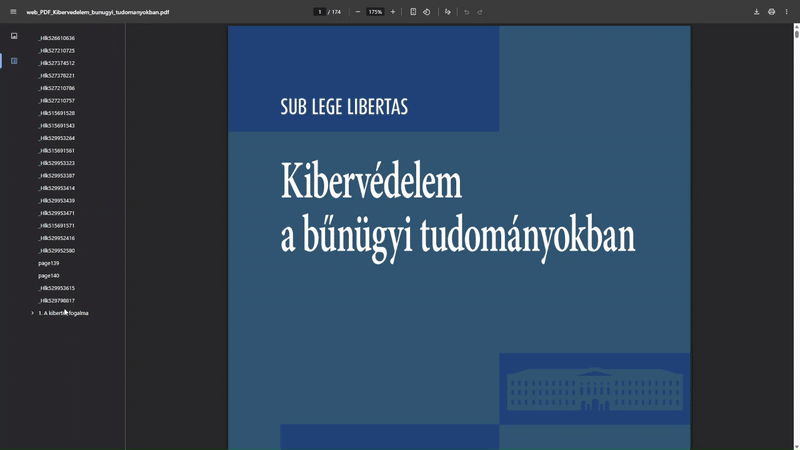

<p align="center">

<h2 align="center">Docling web Dashboard (django web server)</h2>
<p align="center">Upload ppt, docx, pdf, excel etc files and download Docling generated files.</p>
</p>

<p align="center">
  
</p>


<p>
  Run docker or python virtual env. Required cuda and nvidia driver
</p>
<p>
  Modify title, navbar home and footbar text with site_config.py
</p>
<h1>Install</h1>

```bash
git clone https://github.com/n4gy1/docling_dashboard
cd docling_dashboard
sudo docker compose build
sudo docker compose up -d
```

